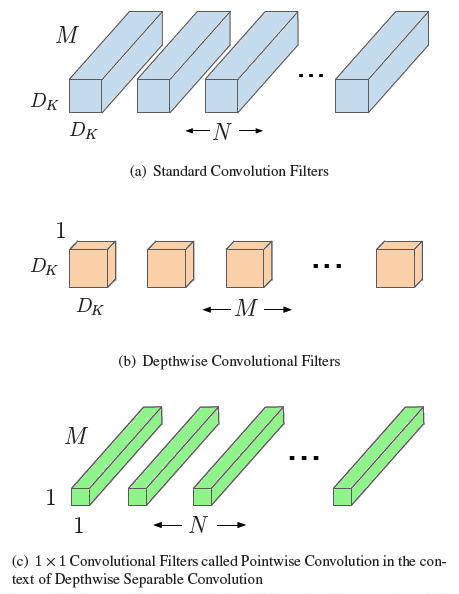
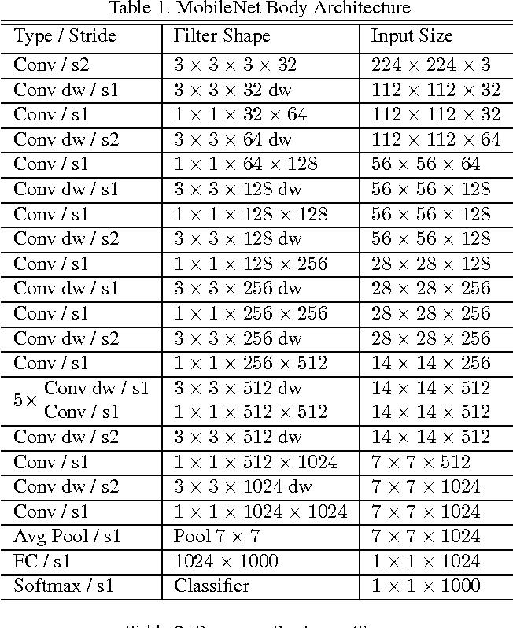

# Pytorch MobileNet v1
A Pytorch Implementation of the 2017 paper ["MobileNets: Efficient Convolutional Neural Networks for Mobile Vision Applications"](https://arxiv.org/pdf/1704.04861.pdf) from Google.



## The Architectures

The following table illustrates the default MobileNet architecture (i.e. the architecture in which both tunable parameters alpha and rho are equal to 1).
Please note however that there appears to be a typo in this table, the final depth-wise convolutional is stated as having a stride of 2 however the table does not indicate an associated decrease in the resolution of the feature maps. 
In this implementation I chose to set the stride of this layer to 1 as this seemed to simplest way to resolve this contradiction while remaining consistent with the reset of the table.
All other implementations I could find adopted the same stratege so I feel quite confident this was true stride that the authors intended for this layer.



## Dataset

In the paper the authors train the model on the ImageNet dataset which is a huge data set of images of objects in 1000 different classes and was used as part of the ImageNet competition which until recently was the main forum of comparison between state of the art image recognition models.
Although this model is absolutely capable of being applied to the full image net dataset I do not recommend this as it is VERY large, approximately 138GB.
Instead, if you wish to train the model yourself, I recommend either using the sample data set in the `/data` directory of the repo which is just a small subset of 11 classes taken from the ImageNet data set or downloading your own subset using the [ImageNet Downloader](https://github.com/mf1024/ImageNet-Datasets-Downloader) project and then using imagemagick and the converter script included in this repo to get the images the correct size and training with that.
If you really want to train with all of ImageNet you can find a few different methods of acquiring it [here](http://www.cloverio.com/download-imagenet/).

## Pretrained Weights

If you lack a graphics card on which to train the model or you just don't want to go through the hassle of training it yourself I have uploaded a `.pkl` file containing a serialized version of the model trained on the included dataset. You may find them [here]().


## Requirements

All you need to run this code are the torch and torchvision libraries.
To install these just run the following command in the root of your local copy of the repo.
Do bear in mind though that you may wish to visit the pytorch website to download the most appropriate versions for your system.
```
sudo pip3 install -r ./requirements.txt
```
